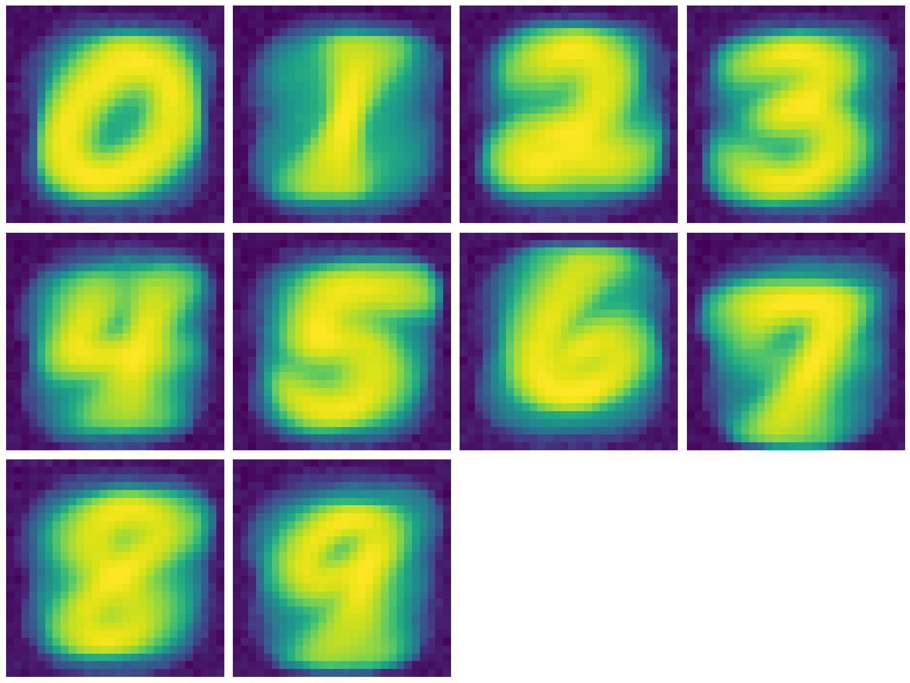

# GenMnist

Mnist, but backward. Lol. Instead of classifying digits, the model is trained to generate images from an input digit between 1-9.

## Data

Calling `loader.load()` should just work. First it will download the imgs.zip.

## Model Architecture

The model is a dumb little MLP with these layers:
- **Input Layer**: One-hot encoded representation of the digit (dimension: 10).
- **Hidden Layer**: 128 neurons with ReLU activation.
- **Output Layer**: A flattened representation of the MNIST image (dimension: 784).

## Usage

1. Instantiate the model:
```python
model = Model()
```

2. Train the model:
```python
model.train()
```

3. Generate images for a list of digits or one digit:
```python
model.generate(list(range(10)))
model.generate(4)
```

This will visualize a grid of generated images corresponding to the digits 0-9.

## Visualization

Generated images are visualized in a grid. Definitely room for improvement but not back for a ~10s training loop.

